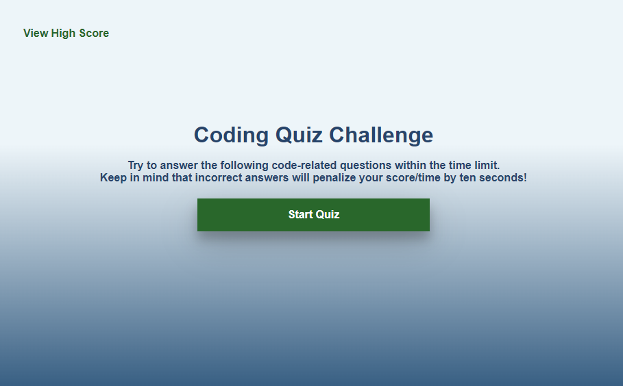
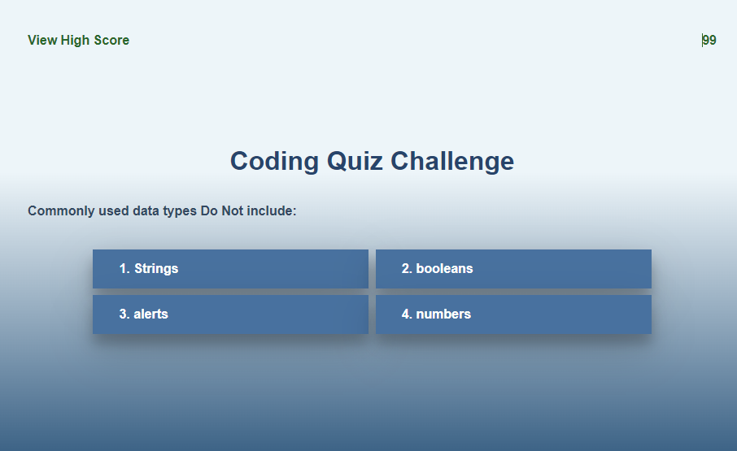
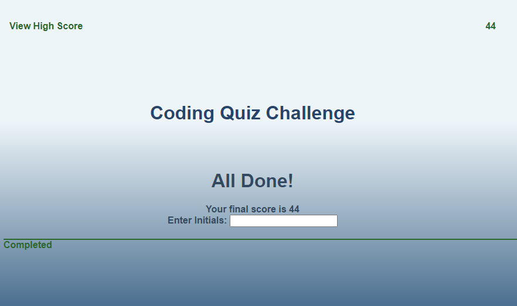
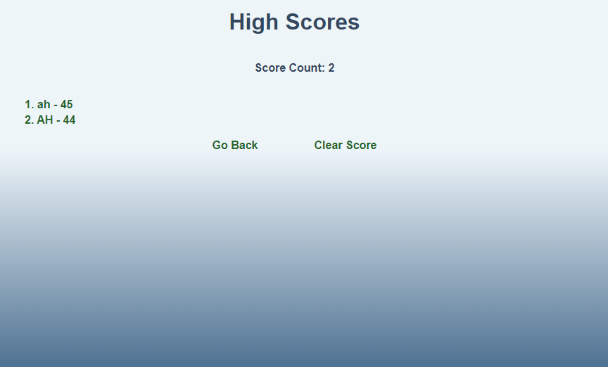

# Code-Quiz

## Questions About Coding Quiz Website
This repository contains list of questions about coding and record their score at the end of each question list that was created by me. When using the website the customers will be able to test their knowledge regarding basic coding.
This project contain 2 pages, the first page host the questions and record participants initials at the end of the questions, the second page will contain list on initials that completed the coding quiz.
This project is mainly focused on showing up my skills in JS web API's that are available to use, and to improve on it as I progress through my learning journey.

## GitHub Repo URL
https://github.com/AllenHirmiz/Code-Quiz

## Website URL
https://allenhirmiz.github.io/Code-Quiz/main/

## Table of Contents
Header
start quiz button
Coding questions
Place to record participants initials
List of participants initials

## Installation
Web Based
## Technologies Used
The coding quiz website is built using the following technologies:

HTML5: The structure and layout of the web pages.
CSS3: Styling and visual enhancements for an appealing user interface.
JavaScript: Dynamic and interactive elements, such as animations and form validation.
Git: Version control system for managing codebase changes.
GitHub Pages: Hosting service for deploying the website.
## Mock-Up

The following image shows the web application's appearance and functionality:

## Customer will be presented with 2 button, and only one button is clickable to all them to generate a custom password based on their criteria. 

## When Generate Password is clicked, the customer will be presented with a few pop-up messages to advise the password length and strength.

## Once the password is generated, the customer will now be able to copy the password by clicking Copy Password button

## Once the password is generated, the customer will now be able to copy the password by clicking Copy Password button

